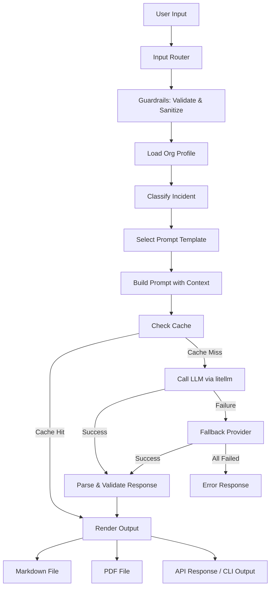

# Incident Response Playbook Generator

> AI-powered agent that generates customized NIST SP 800-61 Rev. 3 incident response playbooks with executable commands, timelines, and escalation paths.

## 🎯 What This Project Demonstrates

- **Multi-Provider LLM Orchestration** — Unified interface across 8+ providers (OpenAI, Anthropic, Deepseek, Minimax, Kimi, Qwen, GLM, Ollama) with automatic fallback
- **Spec-Driven Development** — Complete SDD/BDD specs before code, with Gherkin test scenarios
- **Agent Tool Design** — Structured tool schemas and LLM-optimized descriptions for reliable agent behavior
- **Production API Design** — FastAPI with typed models, Swagger docs, input validation, and safety guardrails
- **Eval-Driven Quality** — Behavioral evaluation cases for regression tracking
- **Governance Layer** — Ownership, kill-switch, model register, and budget controls

## 🛠 Stack

| Component | Technology |
|-----------|-----------|
| Language | Python 3.13 |
| API Framework | FastAPI + Uvicorn |
| CLI Framework | Click |
| LLM Interface | litellm (unified multi-provider) |
| Output Formats | Markdown, PDF (WeasyPrint) |
| Configuration | YAML + dotenv |
| Testing | pytest + pytest-asyncio |
| PDF Generation | WeasyPrint + markdown |

## 🏗 Architecture



**4 Input Modes:**
1. **CLI Argument** — `python src/app.py -d "incident description"`
2. **Interactive CLI** — `python src/app.py -i`
3. **REST API** — `POST /api/v1/playbook` with JSON body
4. **File Input** — `python src/app.py -f incident.txt`

## 🚀 Installation

```bash
git clone https://github.com/0xPdaff/01-incident-response-playbook.git
cd 01-incident-response-playbook
pip install -r requirements.txt
cp .env.example .env  # Add your API keys
```

## 💻 Usage

### CLI Argument Mode
```bash
python src/app.py --description "Ransomware detected on finance server encrypting files"
```

### Interactive Mode
```bash
python src/app.py --interactive
```

### File Input
```bash
python src/app.py --file incident_description.txt
```

### API Server
```bash
python src/app.py --serve
# Swagger UI at http://localhost:8000/docs
```

### API Request Example
```bash
curl -X POST http://localhost:8000/api/v1/playbook \
  -H "Content-Type: application/json" \
  -d '{
    "incident_description": "Ransomware detected on finance server",
    "severity": "critical",
    "provider": "anthropic"
  }'
```

### Provider Selection
```bash
# Use specific provider for this run
python src/app.py -d "..." --provider anthropic

# Default provider is configured in config/model_config.yaml
# Override globally via environment variable
export DEFAULT_PROVIDER=deepseek
```

### Organization Profile

View your current organization profile and tech stack:
```bash
python src/app.py --show-stack
```

Configure your organization profile interactively:
```bash
python src/app.py --setup-stack
```

The setup wizard guides you through configuring your organization name, industry, tech stack, compliance frameworks, escalation contacts, and communication channels. Data is saved to `config/org_profile.yaml` with `demo: false`.

## 📖 CLI Reference

### Flags Overview

| Flag | Short | Description | Type | Default |
|------|-------|-------------|------|---------|
| `--description` | `-d` | Incident description text | string | — |
| `--file` | `-f` | Path to file with incident description | path | — |
| `--interactive` | `-i` | Start guided interactive mode | flag | off |
| `--serve` | `-s` | Start REST API server | flag | off |
| `--severity` | | Severity level | `low` \| `medium` \| `high` \| `critical` | auto-inferred |
| `--provider` | | LLM provider to use | choice (see table) | from config |
| `--format` | | Output format | `markdown` \| `pdf` | `markdown` |
| `--output-dir` | | Directory for generated files | path | `data/processed` |
| `--port` | | API server port | int | `8000` |
| `--verbose` | `-v` | Enable DEBUG logging | flag | off |
| `--extended-help` | `-H` | Show extended usage guide | flag | off |
| `--list-providers` | | Show provider & API key status | flag | off |
| `--help` | | Show basic help | flag | off |
| `--show-stack` | | Display org profile & tech stack | flag | off |
| `--setup-stack` | | Interactive org profile setup wizard | flag | off |

### Input Modes

The generator supports 4 input modes. Pick whichever fits your workflow:

#### 1. CLI Argument (fastest)

Pass the incident description directly on the command line:

```bash
python src/app.py -d "Ransomware detected on finance server encrypting files"
python src/app.py -d "Phishing campaign targeting executives" --severity high --provider anthropic
```

#### 2. Interactive Mode

Guided prompts for description, severity, and provider. Ideal for first-time users:

```bash
python src/app.py -i
```

#### 3. File Input

Load a pre-written incident description from a text file:

```bash
python src/app.py -f incident_description.txt
python src/app.py -f incidents/ransomware.txt --output-dir ./reports --format pdf
```

#### 4. REST API

Start the FastAPI server and interact via HTTP. Comes with Swagger UI:

```bash
python src/app.py --serve
python src/app.py --serve --port 9000    # custom port

# Swagger UI → http://localhost:8000/docs
# ReDoc      → http://localhost:8000/redoc
```

```bash
curl -X POST http://localhost:8000/api/v1/playbook \
  -H "Content-Type: application/json" \
  -d '{
    "incident_description": "Ransomware detected on finance server",
    "severity": "critical",
    "provider": "anthropic"
  }'
```

### Supported Providers

| Provider | Model | API Key Env Var | Local? |
|----------|-------|-----------------|--------|
| `openai` | gpt-4o | `OPENAI_API_KEY` | No |
| `anthropic` | claude-sonnet-4 | `ANTHROPIC_API_KEY` | No |
| `deepseek` | deepseek-chat | `DEEPSEEK_API_KEY` | No |
| `minimax` | MiniMax-M2.7 | `MINIMAX_API_KEY` | No |
| `kimi` | moonshot-v1-128k | `KIMI_API_KEY` | No |
| `qwen` | qwen-max | `QWEN_API_KEY` | No |
| `glm` | glm-4-plus | `GLM_API_KEY` | No |
| `ollama` | llama3 | _(none — runs locally)_ | Yes |

Check which providers are configured:

```bash
python src/app.py --list-providers
```

The system uses an automatic fallback chain (configured in `config/model_config.yaml`). If the primary provider fails, it tries the next one in order.

### Configuration

#### `.env` — API Keys & App Settings

Copy `.env.example` and fill in your API keys:

```bash
cp .env.example .env
```

```dotenv
# At least one provider key required (except Ollama)
OPENAI_API_KEY=sk-...
ANTHROPIC_API_KEY=sk-ant-...
DEEPSEEK_API_KEY=...
MINIMAX_API_KEY=...

# Optional overrides
DEFAULT_PROVIDER=openai
LOG_LEVEL=INFO
API_PORT=8000
```

#### `config/model_config.yaml` — Provider Settings

Defines the model, endpoint, temperature, fallback chain, retry behavior, and rate limits for each provider. Edit this file to change models or add new providers.

#### `config/org_profile.yaml` — Organization Context

Provides your tech stack, SIEM/EDR tools, team contacts, and compliance frameworks so the playbook includes relevant commands and escalation paths. Set `demo: false` after filling in your real data.

```yaml
demo: false
org:
  name: "My Company"
  industry: "technology"
  size: "small"
tech_stack:
  os: ["linux"]
  cloud_providers: ["aws"]
  siem: "splunk"
  edr: "crowdstrike"
```

### Extended Help

For a detailed usage guide with examples and troubleshooting:

```bash
python src/app.py -H          # or --extended-help
```

### FAQ / Troubleshooting

| Issue | Fix |
|-------|-----|
| "No provider available" | Set at least one API key in `.env` or use `--provider ollama` |
| "Description too short" | Provide at least 10 characters |
| Rate limit / 429 errors | Reduce request frequency or switch provider with `--provider` |
| PDF generation skipped | `pip install weasyprint` |
| Ollama connection refused | Start Ollama: `ollama serve && ollama pull llama3` |
| `ModuleNotFoundError` | `pip install -r requirements.txt` |

## 📸 Demo

```bash
python examples/demo.py
```

The demo script showcases all input modes and checks provider availability.

## 📁 Project Structure

```
01-incident-response-playbook/
├── src/
│   ├── app.py                 # Entry point: CLI + API server
│   ├── agent/
│   │   ├── tools/
│   │   │   ├── schemas/       # JSON schemas for agent tools
│   │   │   └── descriptions/  # LLM-optimized tool descriptions
│   │   ├── chains/            # Orchestration: classify → generate
│   │   └── memory/            # Session state management
│   ├── inference/             # Multi-provider LLM engine (litellm)
│   ├── guardrails/            # Input validation, PII detection, safety checks
│   ├── api/                   # FastAPI routes and models
│   ├── caching/               # File-based prompt/response cache
│   └── utils/                 # Config, constants, helpers
├── config/
│   ├── org_profile.yaml       # Organization tech stack & contacts
│   ├── prompts.yaml           # Prompt templates
│   └── model_config.yaml      # Provider settings & fallback chain
├── evals/                     # Behavioral evaluation cases
├── tests/                     # pytest test suite
├── examples/
│   └── demo.py                # Demo script
└── docs/
    ├── SPECS.md               # SDD/BDD specs with Gherkin scenarios
    ├── DECISIONES.md          # Technical decision rationale
    ├── ARQUITECTURA.md        # Architecture diagram
    └── GOVERNANCE.md          # Ownership & safety controls
```

## 📋 Roadmap

- [x] Multi-provider LLM support with fallback
- [x] 4 input modes (CLI arg, interactive, API, file)
- [x] NIST SP 800-61 Rev. 3 structured playbooks
- [x] Org profile-aware command generation
- [x] Input validation and PII detection
- [x] Markdown and PDF output
- [x] Prompt/response caching
- [x] Safety guardrails for destructive commands
- [ ] Web UI (Streamlit dashboard)
- [ ] Playbook versioning and history
- [ ] Custom knowledge base integration
- [ ] Multi-language playbook support

## 📚 References

- [NIST SP 800-61 Rev. 3](https://csrc.nist.gov/pubs/sp/800/61/r3/final) — Computer Security Incident Handling Guide (core playbook structure)
- [MITRE ATT&CK Framework](https://attack.mitre.org/) — Adversary tactics, techniques, and procedures referenced in classifications
- [SANS Incident Handler's Handbook](https://www.sans.org/white-papers/33901/) — Practical incident response methodology
- [FastAPI](https://fastapi.tiangolo.com/) — Modern async Python web framework used for the REST API
- [Click](https://click.palletsprojects.com/) — Python CLI framework for composable command-line interfaces
- [LiteLLM](https://github.com/BerriAI/litellm) — Unified interface for 100+ LLM providers
- [Anthropic Python SDK](https://github.com/anthropics/anthropic-sdk-python) — Used for Anthropic-compatible providers (MiniMax)
- [WeasyPrint](https://weasyprint.org/) — CSS-to-PDF renderer for professional playbook documents
- [LangChain](https://python.langchain.com/) — Framework for building LLM-powered applications
- [Pydantic](https://docs.pydantic.dev/) — Data validation using Python type annotations
- [Eval-Driven Development (Anthropic)](https://docs.anthropic.com/en/docs/build-with-claude/evals) — Evaluation patterns for LLM behavior

## 📄 License

MIT — See [LICENSE](LICENSE)
