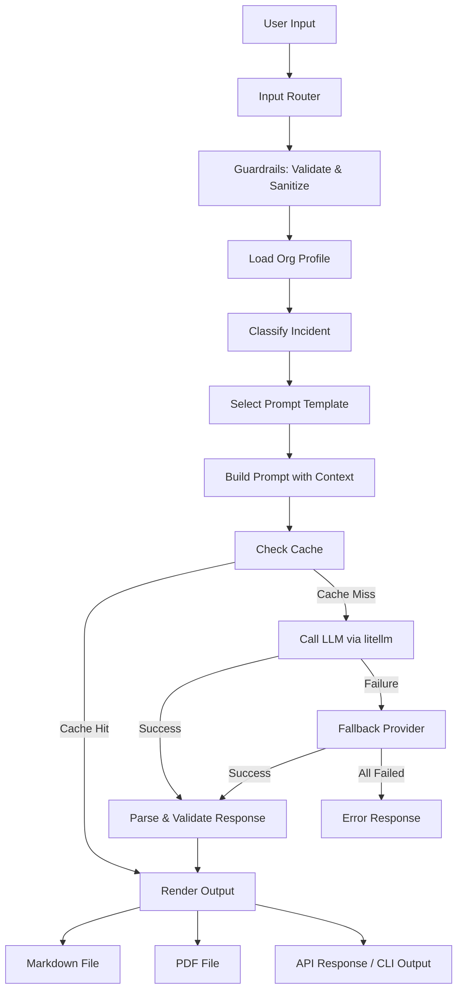

# Incident Response Playbook Generator

> AI-powered agent that generates customized NIST SP 800-61 incident response playbooks with executable commands, timelines, and escalation paths.

## 🎯 What This Project Demonstrates

- **Multi-Provider LLM Orchestration** — Unified interface across 8+ providers (OpenAI, Anthropic, Deepseek, Minimax, Kimi, Qwen, GLM, Ollama) with automatic fallback
- **Spec-Driven Development** — Complete SDD/BDD specs before code, with Gherkin test scenarios
- **Agent Tool Design** — Structured tool schemas and LLM-optimized descriptions for reliable agent behavior
- **Production API Design** — FastAPI with typed models, Swagger docs, input validation, and safety guardrails
- **Eval-Driven Quality** — Behavioral evaluation cases for regression tracking
- **Governance Layer** — Ownership, kill-switch, model register, and budget controls

## 🛠 Stack

| Component | Technology |
|-----------|-----------|
| Language | Python 3.13 |
| API Framework | FastAPI + Uvicorn |
| CLI Framework | Click |
| LLM Interface | litellm (unified multi-provider) |
| Output Formats | Markdown, PDF (WeasyPrint) |
| Configuration | YAML + dotenv |
| Testing | pytest + pytest-asyncio |
| PDF Generation | WeasyPrint + markdown |

## 🏗 Architecture



**4 Input Modes:**
1. **CLI Argument** — `python src/app.py -d "incident description"`
2. **Interactive CLI** — `python src/app.py -i`
3. **REST API** — `POST /api/v1/playbook` with JSON body
4. **File Input** — `python src/app.py -f incident.txt`

## 🚀 Installation

```bash
git clone https://github.com/0xPdaff/01-incident-response-playbook.git
cd 01-incident-response-playbook
pip install -r requirements.txt
cp .env.example .env  # Add your API keys
```

## 💻 Usage

### CLI Argument Mode
```bash
python src/app.py --description "Ransomware detected on finance server encrypting files"
```

### Interactive Mode
```bash
python src/app.py --interactive
```

### File Input
```bash
python src/app.py --file incident_description.txt
```

### API Server
```bash
python src/app.py --serve
# Swagger UI at http://localhost:8000/docs
```

### API Request Example
```bash
curl -X POST http://localhost:8000/api/v1/playbook \
  -H "Content-Type: application/json" \
  -d '{
    "incident_description": "Ransomware detected on finance server",
    "severity": "critical",
    "provider": "anthropic"
  }'
```

### Provider Selection
```bash
# Use specific provider for this run
python src/app.py -d "..." --provider anthropic

# Default provider is configured in config/model_config.yaml
# Override globally via environment variable
export DEFAULT_PROVIDER=deepseek
```

## 📸 Demo

```bash
python examples/demo.py
```

The demo script showcases all input modes and checks provider availability.

## 📁 Project Structure

```
01-incident-response-playbook/
├── src/
│   ├── app.py                 # Entry point: CLI + API server
│   ├── agent/
│   │   ├── tools/
│   │   │   ├── schemas/       # JSON schemas for agent tools
│   │   │   └── descriptions/  # LLM-optimized tool descriptions
│   │   ├── chains/            # Orchestration: classify → generate
│   │   └── memory/            # Session state management
│   ├── inference/             # Multi-provider LLM engine (litellm)
│   ├── guardrails/            # Input validation, PII detection, safety checks
│   ├── api/                   # FastAPI routes and models
│   ├── caching/               # File-based prompt/response cache
│   └── utils/                 # Config, constants, helpers
├── config/
│   ├── org_profile.yaml       # Organization tech stack & contacts
│   ├── prompts.yaml           # Prompt templates
│   └── model_config.yaml      # Provider settings & fallback chain
├── evals/                     # Behavioral evaluation cases
├── tests/                     # pytest test suite
├── examples/
│   └── demo.py                # Demo script
└── docs/
    ├── SPECS.md               # SDD/BDD specs with Gherkin scenarios
    ├── DECISIONES.md          # Technical decision rationale
    ├── ARQUITECTURA.md        # Architecture diagram
    └── GOVERNANCE.md          # Ownership & safety controls
```

## 📋 Roadmap

- [x] Multi-provider LLM support with fallback
- [x] 4 input modes (CLI arg, interactive, API, file)
- [x] NIST SP 800-61 structured playbooks
- [x] Org profile-aware command generation
- [x] Input validation and PII detection
- [x] Markdown and PDF output
- [x] Prompt/response caching
- [x] Safety guardrails for destructive commands
- [ ] Web UI (Streamlit dashboard)
- [ ] Playbook versioning and history
- [ ] Custom knowledge base integration
- [ ] Multi-language playbook support

## 📄 License

MIT — See [LICENSE](LICENSE)
