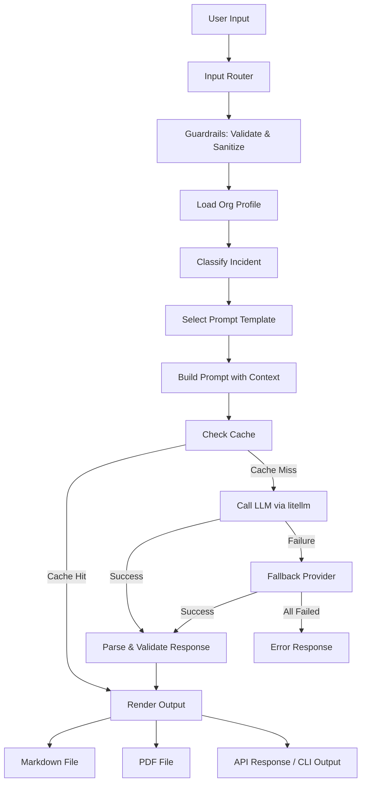

# Architecture

## System Overview

```
┌──────────────────────────────────────────────────────────────────┐
│                     USER INPUT LAYER                             │
│  ┌──────────┐  ┌──────────┐  ┌──────────┐  ┌──────────────────┐ │
│  │ CLI Arg  │  │ CLI Int. │  │ REST API │  │ File Input       │ │
│  └────┬─────┘  └────┬─────┘  └────┬─────┘  └────────┬─────────┘ │
│       │              │              │                 │           │
└───────┼──────────────┼──────────────┼─────────────────┼───────────┘
        │              │              │                 │
        ▼              ▼              ▼                 ▼
┌───────────────────────────────────────────────────────────────────┐
│                      INPUT ROUTER                                  │
│            Normalizes input → IncidentRequest                     │
└───────────────────────────┬───────────────────────────────────────┘
                            │
                            ▼
┌───────────────────────────────────────────────────────────────────┐
│                     GUARDRAILS LAYER                               │
│  ┌──────────────┐  ┌──────────────┐  ┌──────────────────────┐    │
│  │ Input Valid. │  │ Sanitizer    │  │ Rate Limiter         │    │
│  └──────────────┘  └──────────────┘  └──────────────────────┘    │
└───────────────────────────┬───────────────────────────────────────┘
                            │
                            ▼
┌───────────────────────────────────────────────────────────────────┐
│                      AGENT CORE                                   │
│                                                                   │
│  ┌─────────────┐    ┌──────────────┐    ┌──────────────────┐     │
│  │ Org Profile │───▶│ Incident     │───▶│ Playbook         │     │
│  │ Loader      │    │ Classifier   │    │ Generator        │     │
│  └─────────────┘    └──────────────┘    └──────────────────┘     │
│         │                   │                     │               │
│         │           ┌───────┴────────┐            │               │
│         │           │ Knowledge Base │            │               │
│         │           │ (NIST/SANS/    │            │               │
│         │           │  MITRE)        │            │               │
│         │           └────────────────┘            │               │
│         │                                         │               │
│  ┌──────┴─────────────────────────────────────────┴──────────┐   │
│  │              PROMPT ENGINEER                               │   │
│  │  Templates from config/prompts.yaml + org context          │   │
│  └────────────────────────────┬──────────────────────────────┘   │
└───────────────────────────────┼───────────────────────────────────┘
                                │
                                ▼
┌───────────────────────────────────────────────────────────────────┐
│                   INFERENCE LAYER                                  │
│  ┌──────────────────────────────────────────────────────────┐    │
│  │                    litellm                                │    │
│  │  ┌────┐ ┌────┐ ┌────┐ ┌────┐ ┌────┐ ┌────┐ ┌────┐      │    │
│  │  │OAI │ │ANT │ │DS  │ │MMX │ │KIMI│ │QWN │ │OLL │      │    │
│  │  └────┘ └────┘ └────┘ └────┘ └────┘ └────┘ └────┘      │    │
│  │         Fallback chain: primary → secondary → local      │    │
│  └──────────────────────────────────────────────────────────┘    │
│                                                                   │
│  ┌─────────────────┐                                              │
│  │ Cache Layer     │  Avoid regenerating identical requests       │
│  └─────────────────┘                                              │
└───────────────────────────┬───────────────────────────────────────┘
                            │
                            ▼
┌───────────────────────────────────────────────────────────────────┐
│                     OUTPUT LAYER                                   │
│  ┌──────────────┐  ┌──────────────┐  ┌──────────────────────┐    │
│  │ Markdown     │  │ PDF          │  │ Console Output       │    │
│  │ Renderer     │  │ (WeasyPrint) │  │ (rich/Click)         │    │
│  └──────────────┘  └──────────────┘  └──────────────────────┘    │
└───────────────────────────────────────────────────────────────────┘
```

## Data Flow



## Component Responsibilities

| Component | Responsibility |
|-----------|---------------|
| `src/app.py` | Entry point: CLI + API server |
| `src/agent/tools/` | Tool schemas and descriptions for the LLM |
| `src/agent/chains/` | Orchestration: classify → generate → render |
| `src/agent/memory/` | Session state and org profile caching |
| `src/inference/` | litellm wrapper with fallback chain |
| `src/guardrails/` | Input validation, sanitization, output checks |
| `src/api/` | FastAPI routes and models |
| `src/utils/` | Config loading, constants, helpers |
| `src/caching/` | Prompt/response caching to reduce API costs |
| `config/` | YAML configs: org profile, prompts, model settings |
| `evals/` | Behavioral evaluation cases |
